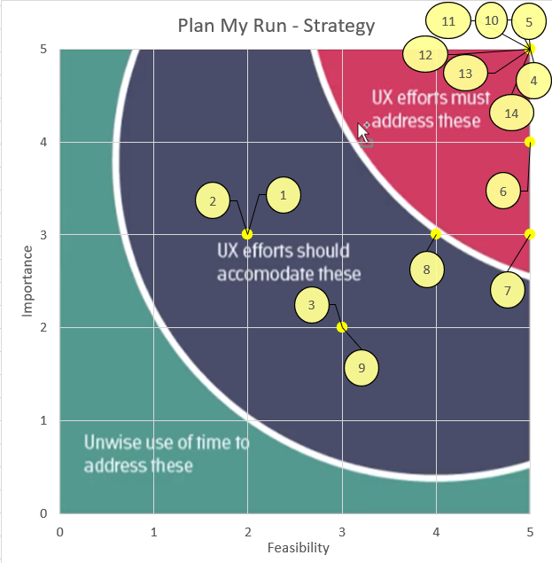

# Josie Annes Patisserie Ecommerce Website
Ecommerce website for the business Josie Anne's Patisserie.

## Feature Choice

There are lots of features I'd like to add, but I am under a time crunch so feature ranking will be used to prioritize.

### List of all Features Wanted

All the features wanted for the site and a sub list stating what is involved if more than one thing.

1. Order cake
    a. Admin – confirm order
    b. User – order
2. Noticeboard
    a. User – Add notice
    b. Admin – Approve notice
3. Book table
    a. Book table
    b. Set days tables aren’t available
4. CRUD shop items
    a. Create
    b. Read
    c. Update
    d. Delete
5. Navigation
    a. Navbar
    b. Footer
6. View user details
    a. Personal
    b. Past orders
    c. Table booking status
    d. Cake order Status
7. Edit user details
    a. Personal
8. Rate a product
9. Leave a review
10. Check out and pay for items
11. Shopping cart
    a. Visitor/User - Add items
    b. Visitor/User - Remove items
12. Authentication
    a. Registration
    b. Sign in
    c. Sign out
13. Sign up for newsletter
14. View items
    a. Detailed view
    b. List of items
    c. Filter items

### Feature Ranking

| Feature No. | Feature                     | Importance | Feasibility  |
|-------------|-----------------------------|------------|--------------|
| 1           | Order cake                  | 3          | 2            |
| 2           | Noticeboard                 | 3          | 2            |
| 3           | Book table                  | 2          | 3            |
| 4           | CRUD shop items             | 5          | 5            |
| 5           | Navigation                  | 5          | 5            |
| 6           | View user details           | 4          | 5            |
| 7           | Edit user details           | 3          | 5            |
| 8           | Rate a product              | 3          | 4            |
| 9           | Leave a review              | 2          | 3            |
| 10          | Check out and pay for items | 5          | 5            |
| 11          | Shopping cart               | 5          | 5            |
| 12          | Authentication              | 5          | 5            |
| 13          | Sign up for newsletter      | 5          | 5            |
| 14          | View items                  | 5          | 5            |

#### Final ranking
| Feature No. | Feature                      |
|-------------|------------------------------|
| 4           | CRUD shop items              |
| 5           | Navigation                   |
| 10          | Check out and pay for items  |
| 11          | Shopping cart                |
| 12          | Authentication               |
| 13          | Sign up for newsletter       |
| 14          | View items                   |
| 6           | View user details            |
| 7           | Edit user details            |
| 8           | Rate a product               |
| 1           | Order cake                   |
| 2           | Noticeboard                  |
| 3           | Book table                   |
| 9           | Leave a review               |

## User Stories

### Visitors User Stories
- As a visitor I want to be able to view all the items for sale 
- As a visitor I want to be able to view the Homepage
- As a visitor I want to be able to filter all the items by price, category, and ingredients
- As a visitor I want to be able to view an item in detail so I can read a description, view the image larger, see the ingredients and all other relevant details of the item.
- As a visitor I want to be able to sign up for a newsletter
- As a visitor I want to be able to register as a user 
- As a visitor I want to be able to add items to my shopping cart
- As a visitor I want to be able to check out and pay for items in my shopping cart
- As a visitor I want to be able to navigate through the site

### User Stories
- As a user I want to be able to sign in 
- As a user I want to be able to sign out
- As a user I want to be able to select items and add them to my shopping cart
- As a user I want to be able to select items and remove them to my shopping cart
- As a user I want to be able to check out and pay for items in my shopping cart
- As a user I want to be able to add a notice to noticeboard for review
- As a user I want to be able to leave a review
- As a user I want to be able to rate a product
- As a user I want to be able to book a table
- As a user I want to be able to order a cake
- As a user I want to be able to view my details
- As a user I want to be able to edit my details

### Admin User Stories
- As admin I want to be able to CRUD items for shop
- As admin I want to be able to approve notices
- As admin I want to be able to approve booking of a table
- As an admin I want to be able to confirm the order of a cake
- As an admin I want to be able to set the days that tables are available

## Things I used to help

- [ShareX](https://getsharex.com/): Screenshots
- [TableConvert](https://tableconvert.com/markdown-generator): README table generation
