# Josie Annes Patisserie Ecommerce Website
Ecommerce website for the business Josie Anne's Patisserie.

[Link to live site](https://josie-annes.onrender.com/)

## Feature Choice

There are lots of features I'd like to add, but I am under a time crunch so feature ranking will be used to prioritize.

### List of all Features Wanted

All the features wanted for the site and a sub list stating what is involved if more than one thing.

1. Order cake

    a. Admin – confirm order

    b. User – order

2. Noticeboard

    a. User – Add notice

    b. Admin – Approve notice

3. Book table

    a. Book table

    b. Set days tables aren’t available

4. CRUD shop items

    a. Create

    b. Read

    c. Update

    d. Delete

5. Navigation

    a. Navbar

    b. Footer

6. View user details

    a. Personal

    b. Past orders

    c. Table booking status

    d. Cake order Status

7. Edit user details

    a. Personal

8. Rate a product

9. Leave a review

10. Check out and pay for items

11. Shopping cart

    a. Visitor/User - Add items

    b. Visitor/User - Remove items

12. Authentication

    a. Registration

    b. Sign in

    c. Sign out

13. Sign up for newsletter

14. View items

    a. Detailed view

    b. List of items

    c. Filter items

### Feature Ranking

| Feature No. | Feature                     | Importance | Feasibility |
|-------------|-----------------------------|------------|-------------|
| 1           | Order cake                  | 3          | 2           |
| 2           | Noticeboard                 | 3          | 2           |
| 3           | Book table                  | 2          | 3           |
| 4           | CRUD shop items             | 5          | 5           |
| 5           | Navigation                  | 5          | 5           |
| 6           | View user details           | 4          | 5           |
| 7           | Edit user details           | 3          | 5           |
| 8           | Rate a product              | 3          | 4           |
| 9           | Leave a review              | 2          | 3           |
| 10          | Check out and pay for items | 5          | 5           |
| 11          | Shopping cart               | 5          | 5           |
| 12          | Authentication              | 5          | 5           |
| 13          | Sign up for newsletter      | 5          | 5           |
| 14          | View items                  | 5          | 5           |


#### Final ranking
| Feature No. | Feature                      |
|-------------|------------------------------|
| 12          | Authentication               |
| 4           | CRUD shop items              |
| 5           | Navigation                   |
| 10          | Check out and pay for items  |
| 11          | Shopping cart                |
| 13          | Sign up for newsletter       |
| 14          | View items                   |
| 6           | View user details            |
| 7           | Edit user details            |
| 8           | Rate a product               |
| 1           | Order cake                   |
| 2           | Noticeboard                  |
| 3           | Book table                   |
| 9           | Leave a review               |


## User Stories

### Visitors User Stories
- As a visitor I want to be able to view all the items for sale 
- As a visitor I want to be able to view the Homepage
- As a visitor I want to be able to filter all the items by price, category, and ingredients
- As a visitor I want to be able to view an item in detail so I can read a description, view the image larger, see the ingredients and all other relevant details of the item.
- As a visitor I want to be able to sign up for a newsletter
- As a visitor I want to be able to register as a user 
- As a visitor I want to be able to add items to my shopping cart
- As a visitor I want to be able to check out and pay for items in my shopping cart
- As a visitor I want to be able to navigate through the site

### User Stories
- As a user I want to be able to sign in 
- As a user I want to be able to sign out
- As a user I want to be able to select items and add them to my shopping cart
- As a user I want to be able to select items and remove them to my shopping cart
- As a user I want to be able to check out and pay for items in my shopping cart
- As a user I want to be able to add a notice to noticeboard for review
- As a user I want to be able to leave a review
- As a user I want to be able to rate a product
- As a user I want to be able to book a table
- As a user I want to be able to order a cake
- As a user I want to be able to view my details
- As a user I want to be able to edit my details

### Admin User Stories
- As admin I want to be able to CRUD items for shop
- As admin I want to be able to approve notices
- As admin, I want to be able to approve booking of a table
- As an admin I want to be able to confirm the order of a cake
- As an admin I want to be able to set the days that tables are available

## Data Models

### Product Model

| Key         | Name        | Type         | Extra Info      |
|-------------|-------------|--------------|-----------------|
| ForeignKey  | category    | Category     |                 |
|             | sku         | CharField    |                 |
|             | name        | CharField    |                 |
|             | description | TextField    |                 |
|             | price       | DecimalField |                 |
|             | rating      | DecimalField |                 |
|             | image_url   | URLField     |                 |
|             | image       | ImageField   |                 |
|             | hidden      | BooleanField |                 |
|             | ingredients | TextField    |                 |
|             | allergens   | Allergens    | ManyToManyField |

### Allergen Model

| Key | Name    | Type       | Extra Info |
|-----|---------|------------|------------|
|     | allergy | CharField  | choices    |

### Category Model

| Key | Name          | Type       | Extra Info |
|-----|---------------|------------|------------|
|     | name          | CharField  |            |
|     | friendly_name | CharField  |            |

### Order Item Model

| Key        | Name           | Type         | Extra Info |
|------------|----------------|--------------|------------|
| ForeignKey | order          | Order        |            |
| ForeignKey | product        | Product      |            |
|            | quantity       | IntegerField |            |
|            | lineitem_total | DecimalField |            |

### Order Model

| Key         | Name            | Type          | Extra Info |
|-------------|-----------------|---------------|------------|
|             | order_number    | CharField     |            |
| Foreign Key | user_profile    | UserProfile   |            |
|             | full_name       | CharField     |            |
|             | email           | EmailField    |            |
|             | phone_number    | CharField     |            |
|             | country         | CountryField  |            |
|             | eircode         | CharField     |            |
|             | town_or_city    | CharField     |            |
|             | street_address1 | CharField     |            |
|             | street_address2 | CharField     |            |
|             | county          | CharField     |            |
|             | date            | DateTimeField |            |
|             | delivery_cost   | DecimalField  |            |
|             | order_total     | DecimalField  |            |
|             | grand_total     | DecimalField  |            |
|             | original_bag    | TextField     |            |
|             | stripe_pid      | CharField     |            |

### Afternoon Tea booking Model

| Key | Name           | Type                 | Extra Info        |
|-----|----------------|----------------------|-------------------|
|     | booking_number | CharField            |                   |
|     | full_name      | CharField            |                   |
|     | email          | EmailField           |                   |
|     | phone_number   | CharField            |                   |
|     | date           | DateField            |                   |
|     | time           | CharField            |                   |
|     | notes          | TextField            |                   |
|     | under_review   | BooleanField         |                   |
|     | no_of_people   | PositiveIntegerField | limit to 6 people |

### Cake Order Model

| Key | Name              | Type         | Extra Info |
|-----|-------------------|--------------|------------|
|     | cake_order_number | CharField    |            |
|     | full_name         | CharField    |            |
|     | email             | EmailField   |            |
|     | phone_number      | CharField    |            |
|     | date              | DateField    |            |
|     | notes             | TextField    |            |
|     | under_review      | BooleanField |            |

### User Profile Model

| Key | Name                    | Type         | Extra Info     |
|-----|-------------------------|--------------|----------------|
|     | user                    | User         | OneToOneField  |
|     | default_phone_number    | CharField    |                |
|     | default_street_address1 | CharField    |                |
|     | default_street_address2 | CharField    |                |
|     | default_town_or_city    | CharField    |                |
|     | default_county          | CharField    |                |
|     | default_eircode         | CharField    |                |
|     | default_country         | CountryField |                |

## Design choices

### Sitemap


### Wireframes

#### Header


#### Homepage


#### Footer


#### Booking Afternoon Tea


#### Order Cake


## Features

### Navbar

#### Navbar desktop


#### Navbar mobile


## Homepage

#### Links to stores


#### Product Card Homepage


#### Newsletter Sign Up


#### Afternoon Tea Link on Homepage


## Footer

### Footer Nav


### Footer Social Media Links


## Store

### Product Search Bar


### Product Filters


### Product Card in Products page


## Booking Afternoon Tea Form


## Order Cake Form


## Product Detail Page Quantity, Keep Shopping, and Add to Cart


## Messages

### Success Pop Up


### Successful Checkout


## Cart Functionality


## Secure Checkout

### Checkout Form


### Loading Screen


###


## Web Marketing

### Facebook Business Page

Link to created page: https://www.facebook.com/profile.php?id=100087897433792 


## Errors

### Reverting all migrations

I tried to revert all migrations near the beginning and ran into this error:


I was able to solve it with [Instructions found on Stack Overlflow](https://stackoverflow.com/questions/50346326/programmingerror-relation-django-session-does-not-exist) and running migrations again when I had made changes.

### Internal Server Error 500

I wasn’t getting an error when running locally, and it built fine on Heroku. There were no errors in the console on the
on Heroku. All I was getting as “Internal Server Error 500” (see image below). So I created a new branch from the last 
commit and hosted that instead. That actually worked when built in Heroku so from that I knew it was something in the 
last commit that was causing the error. After comparing the code to the tutorial I realized I wasn’t missing anything. 
So after thinking further I thought it might be something that my local environment had that my Heroku one didn’t. 
Turns out I hadn’t added stripe to requirements.txt


### Custom Widget Template does not exist

After checking the paths were all correct I went searching online for a solution. I found 
[this solution](https://stackoverflow.com/questions/45844032/django-templatedoesnotexist-in-case-of-a-custom-widget)
on Stack Overflow by user3763125.


### Page Not Found

This was an interesting one. I realized the path I want the app to take wasn't in the list of urls
in the below image. This led me to guess moving my url up in the list would help it be found first and 
it worked.


## Testing

### Validation testing

Validation testing was done with PyCharms built in formatters for Python, HTML, CSS, and JavaScript.

## Deployment

**Josie Anes Patisserie** was developed using the **PyCharm IDE**, and using **Git** and **GitHub** for version control. 
It is hosted on **Heroku** and all media files are hosted in **Cloudinary**.

Before deploying the application, install the following:

- Python 3
- PIP
- Git
- Heroku CLI

### Local Deployment

To deploy josie-annes-patisserie locally, take the following steps:

1. From the applications' [repository](https://github.com/sean-meade/josie-annes-patisserie), click the *code* button and download the zip file.

    Alternatively, you can clone the repository using the following line in your command prompt:

```terminal
git clone https://github.com/sean-meade/josie-annes-patisserie
```

2. Access the folder in your terminal window and install the application's required modules with the following command:

```terminal
pip3 install -r requirements.txt
```

3. Create the following environmental variables on your machine:

```
DATABASE_URL = YOUR_DATABASE_URL
SECRET_KEY = YOUR_DJANGO_SECRET_KEY
CLOUDINARY_URL = YOUR_CLOUDINARY_KEY
DEBUG = True (False for production)
STRIPE_PUBLIC_KEY = YOUR_STRIPE_PUBLIC_KEY
STRIPE_SECRET_KEY = YOUR_STRIPE_SECRET_KEY
STRIPE_WH_SECRET = YOUR_STRIPE_WH_SECRET

```

4. In your IDE terminal, migrate the models to create the database using the following commands:

```terminal
python manage.py makemigrations
python manage.py migrate
```

5. Create a superuser to access the admin panel using the following command:

```terminal
python manage.py createsuperuser
```

Then follow the instructions to create the superuser.

6. After you login to the admin panel, you can add data to be displayed in your app. Refer to [database modeling](#database-modelling).


7. To initiate the application, type the command `python manage.py runserver` in your terminal. The application is now available in your browser at the address: `http://127.0.0.1:8000/`

[Back to content](#contents)

### Deployment to Heroku

To deploy the app to Heroku, use the following steps:

3. Clone the repository like above.
4. Push these newly created files to your repository master.
5. Login to Heroku and create a new app.
6. In Heroku dashboard of the new app, click **deploy**, then **deployment** method and select **GitHub** to connect your app to your github repository for automatic deployment.
7. In Heroku Resources tab, navigate to **Add-Ons** section and search for **Heroku Postgres**. I recommend you choose hobby level for this application. You should also search for **Cloudinary - Image and Video Management** to ensure your media files load to Cloudinary.
8. In settings tab, navigate to **Reveal Config Vars** and add the following variables:

| **KEY**           | **VALUE**               |
|-------------------|-------------------------|
| CLOUDINARY_URL    | YOUR_CLOUDINARY_URL     |
| DATABASE_URL      | YOUR_DATABASE_URL       |
| DEBUG_BOOL        | YOUR_DEBUG_BOOL         |
| SECRET_KEY        | YOUR_DJANGO_SECRET_KEY  |
| STRIPE_PUBLIC_KEY | YOUR_STRIPE_PUBLIC_KEY  |
| STRIPE_SECRET_KEY | YOUR_STRIPE_SECRET_KEY  |
| STRIPE_WH_SECRET  | YOUR_STRIPE_WH_SECRET  |

9. In settings.py in your IDE, temporarily comment out the database and use below code instead (make sure you do not commit!):

```python
DATABASES = {
        'default': dj_database_url.parse('POSTGRESS URL')
    }
```

10. In terminal, migrate the models to create the Postgress database using the following commands:

```terminal
python manage.py makemigrations
python manage.py migrate
```

11. Create a superuser to access the admin panel using the following command:

```terminal
python manage.py createsuperuser
```

Then follow the instructions to create the superuser.

12. After you login to the admin panel, you can add data to be displayed in your app if required.

13. Remove the temporary database from settings.py and uncomment the original code, then push the code to origin.
14. Back to in **Heroku dashboad**, deploy the application.
15. To view the site, click on **View App**.

## Testing

First Registered with admin and got email to confirm:


Then was able to add and delete products:
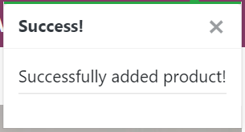
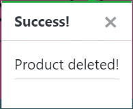


Then was able to register as user and didn't see admin functionality:
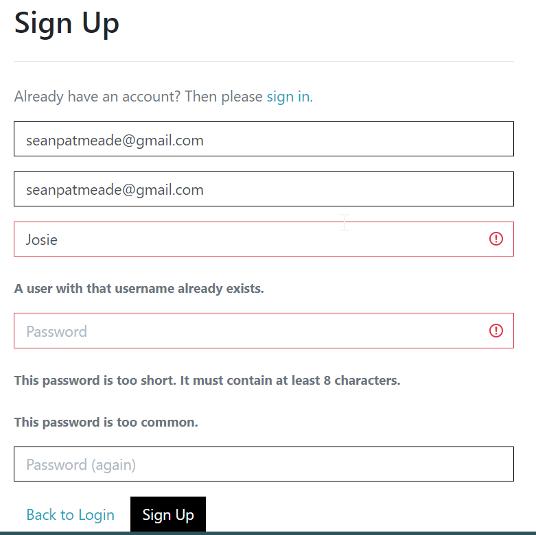
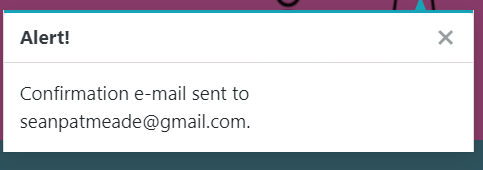
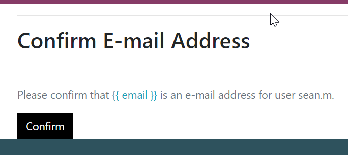
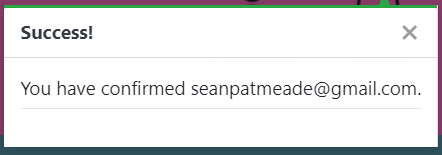
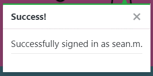

The was able to browse the store, add products, and update the cart with quantity. Was also able to delete from it.
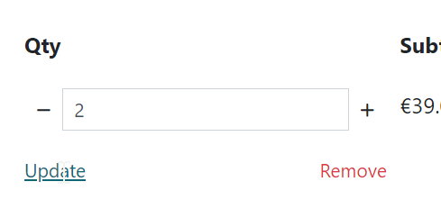
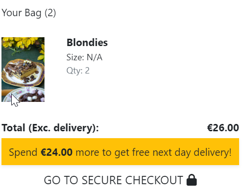
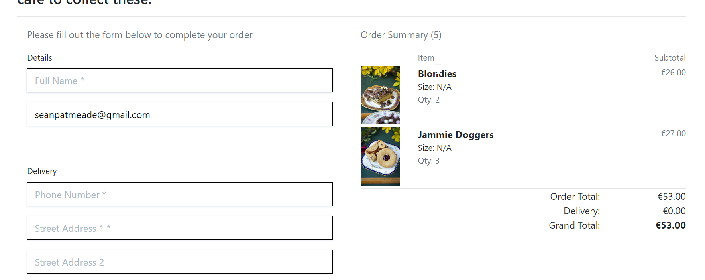
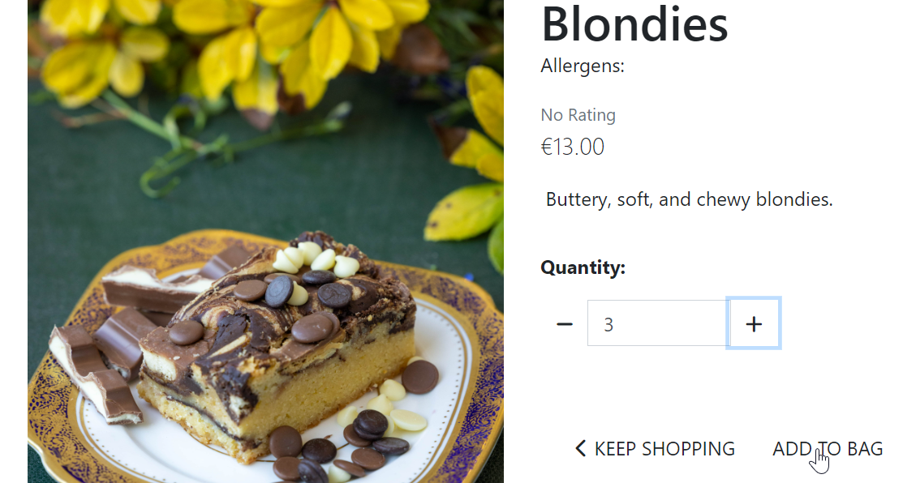

Then I was able to go as far as secure checkout:
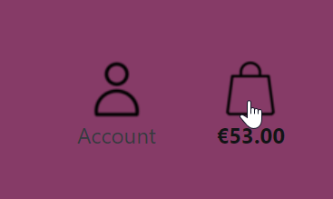

Then update my details in profile and go back to secure checkout and my details were already populated:
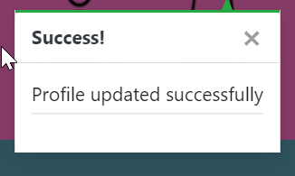

Then was not able to checkout unless all details were correct:
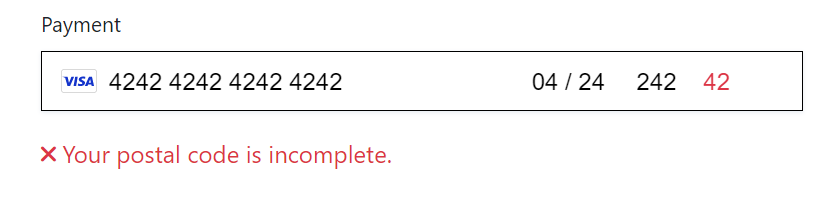
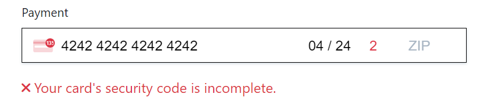
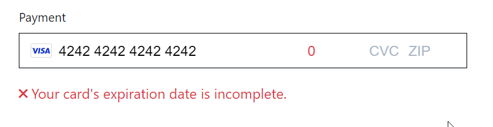
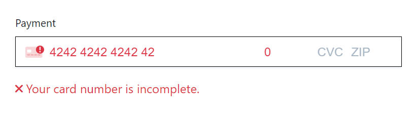
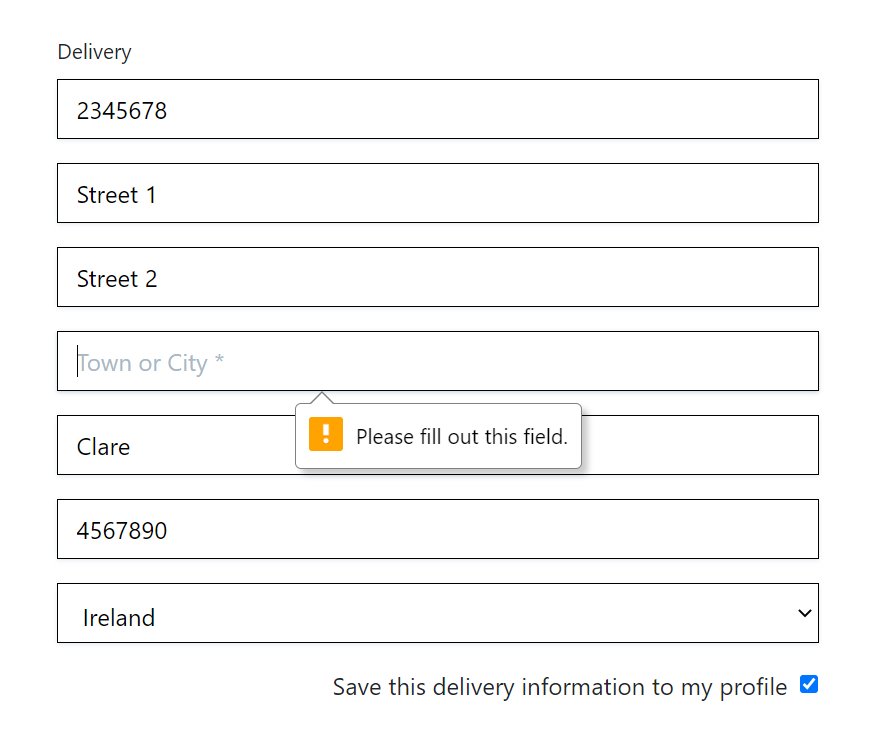
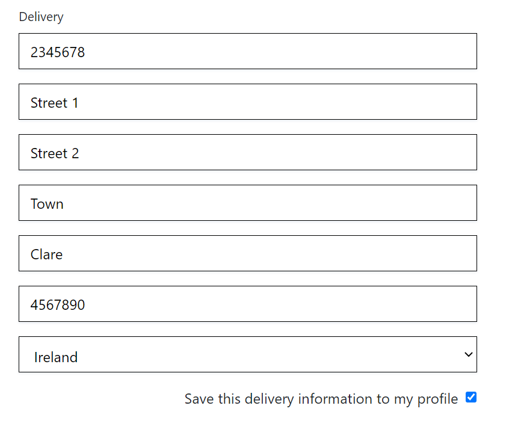
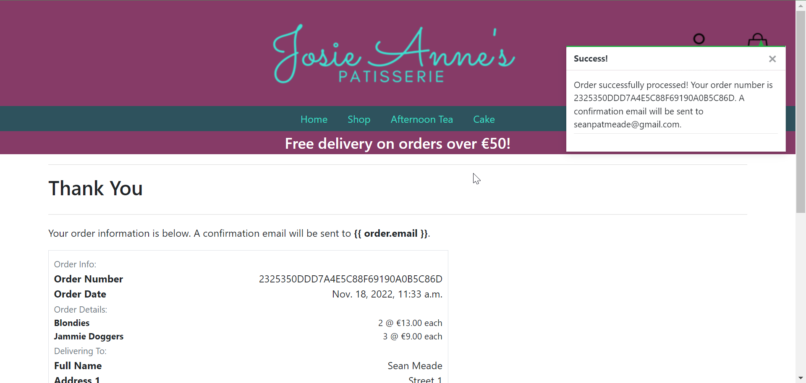

Was able to book an afternoon tea through form:
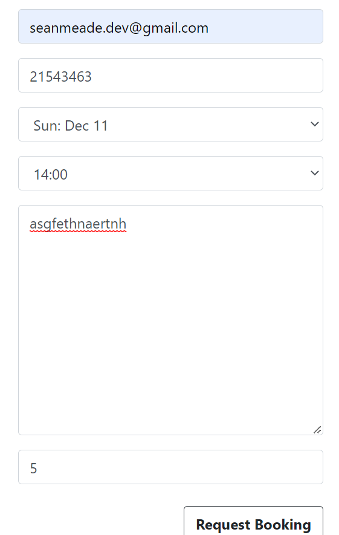


Was able to order a cake through form:
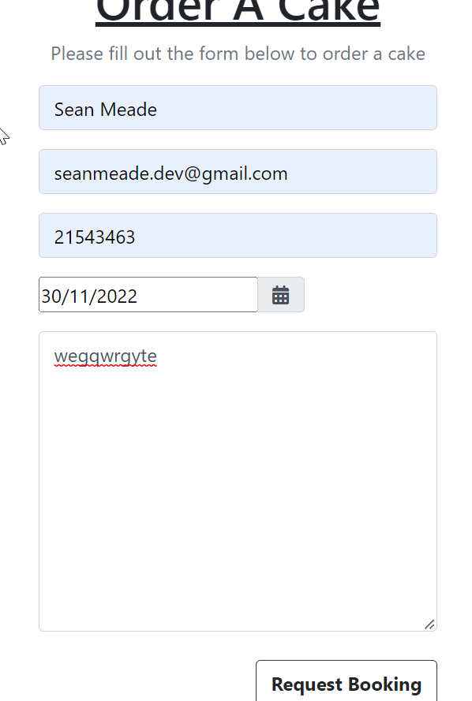
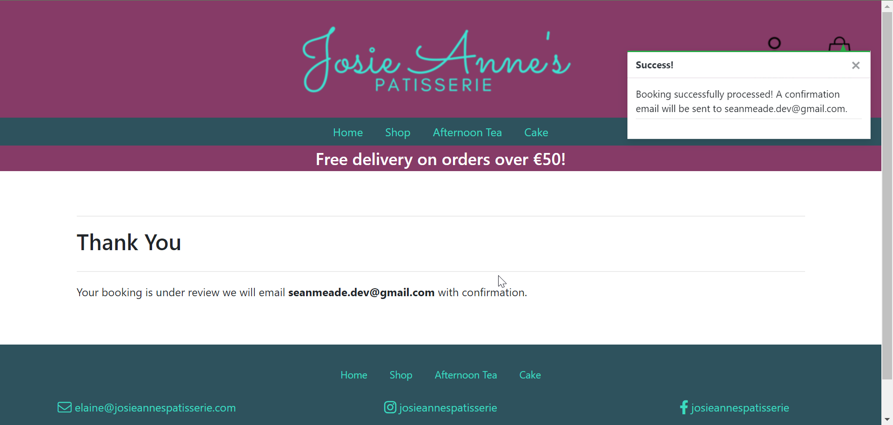

And was able to log out

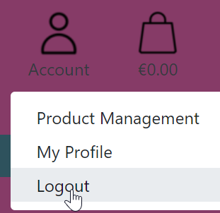

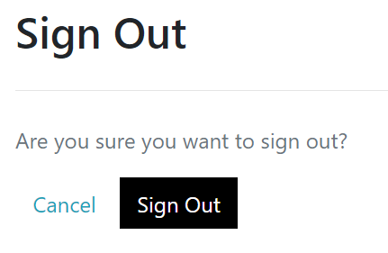

## Technology Used

- [ShareX](https://getsharex.com/): Screenshots
- [TableConvert](https://tableconvert.com/markdown-generator): README table generation
- [Bootstrap 4.6](https://getbootstrap.com/docs/4.6/getting-started/introduction/): Styling
- [Google Fonts](https://fonts.google.com/specimen/Sacramento): Sacramento font
- [CUFON Fonts](https://www.cufonfonts.com/font/glacial-indifference): Glacial Indifference Font
- [flaticon](https://www.flaticon.com/): Icons
- [LUNAPIC](https://www12.lunapic.com/editor/): Image editing
- [Django](https://www.djangoproject.com/): Python web framework
- [SQlite3](https://www.sqlite.org/index.html): Database used in production
- [PostgreSQL](https://www.postgresql.org/): Database used in development
- [FontAwesome](https://www.bootstrapcdn.com/fontawesome/): Icons
- [jQuery](https://jquery.com/): Common JS library for web development
- [Heroku](https://dashboard.heroku.com/apps): Free hosting
- [PyCharm](https://www.jetbrains.com/pycharm/): IDE for Python development
- []():
- []():
- []():
